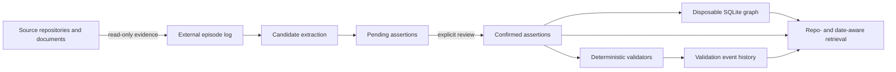

# Design: Temporal Knowledge Graph

This design implements [SPEC-0001](spec.md) as an external evidence system.
The central choice keeps durable truth records human-reviewable and treats the
graph as a rebuildable projection outside every source repository.

## Context

The current CLI has three useful foundations: append-only episode capture,
review-gated Markdown assertions, and a SQLite graph cache that can be rebuilt
from durable records. It also has deterministic validators for repository
paths and file contents, with validation events retained alongside assertions.
Legacy assertions and pending candidates have been structurally migrated into
episodes without inventing typed relations from prose.

The next work is therefore not a graph rewrite. It is a controlled expansion:
derive typed relation candidates from explicit evidence, add validator families
where an authoritative source exists, then make sweep selection routine and
measurable.

## Architecture

### Durable records

Episodes are the raw evidence layer. They are append-only, timestamped, and
linked to a source. Pending candidates are atomic claims extracted from an
episode or proposed by an agent. Confirmed assertions are review-approved
Markdown records. Validation events never replace the original assertion; they
add support, contradiction, or uncertainty to its audit trail.

### Graph projection

The SQLite graph contains entities, typed edges, and episode/assertion links.
It is an acceleration layer only: a fingerprint of durable records determines
when to rebuild it. Deleting the cache is a recovery operation; durable records
remain intact. Trusted graph queries exclude pending relations by default.

### Repository and time model

Every record carries a repository when known, plus observed and validity time.
Retrieval uses the active repository as a relevance constraint and retains
global records. An `as-of` date filters temporal validity. If an assertion
declares a commit interval and a checkout can be inspected, ancestry decides
whether the assertion applies to that checkout.

### Validation model

Validators are named, deterministic implementations with a precise target and
evidence contract. They return `supported`, `contradicted`, `unknown`, or
`not_applicable`. Only a validator with affirmative evidence can support a
claim; only a validator that directly disproves its predicate can contradict
it. Missing access, missing configuration, or unsupported predicates return
`unknown` or `not_applicable`.

## Decisions

### D1: Review gates truth, not ingestion

Agents may ingest observations freely. Rate limiting intake would discard
useful evidence and hides provenance. Review gates promotion into trusted
memory instead, which keeps unbounded capture separate from bounded human
attention.

### D2: Typed extraction produces candidates

Initial extractors should focus on evidence with stable structure: ownership
declarations, repository paths, service-to-repository mappings, and declared
dependencies. Each extractor produces a pending subject-predicate-object
candidate tied to its episode. A reviewer controls trust.

### D3: Validators are predicate-specific

A generic validator cannot safely judge every assertion. Each validator family
declares the predicates and evidence sources it understands. The first two
families remain path existence and file-content checks; later families add
ownership documents, infrastructure manifests, and catalog records only after
their authority and failure modes are documented.

### D4: Sweep selection is deterministic and explainable

The scheduler should prioritise assertions that are stale, invalidated,
high-impact, or affected by recent repository changes. It must record why each
assertion was selected, enforce a bounded per-run work budget, and allow a
manual targeted sweep. Scheduling must not mutate truth state; validators do.

## Delivery Plan

### Slice 1: Typed candidate extraction

Add extractor interfaces and fixtures for explicit ownership and path evidence.
Persist source episode identifiers, typed fields, repository, and parser
version on every candidate. Measure precision at review time before adding
broader extraction patterns.

### Slice 2: Authoritative validator families

Add validators for the same narrow predicates: ownership documents first,
then declared infrastructure topology and catalog mappings. Each validator
gets positive, negative, missing-evidence, and unavailable-checkout tests.

### Slice 3: Sweep orchestration

Implement prioritised selection with an explainable score, dry-run output,
per-run budget, and a scheduled invocation outside source repositories.
Record run summaries so coverage and failure rates can be monitored.

### Slice 4: Retrieval and review quality

Add a fixture corpus for repository/date isolation, graph-neighbour precision,
and stale-fact handling. Consolidate duplicate legacy candidates only after
the fixtures establish that evidence and provenance are preserved.

### Slice 5: Operational hardening

Document backup/restore of the external store, cache rebuild recovery, and
index health checks. Add corruption, interrupted-write, and concurrent-reader
tests where the implementation's storage primitives require them.

## Risks and Mitigations

| Risk | Mitigation |
| --- | --- |
| Extracted relations create review noise | Start with explicit structures, keep candidates pending, and measure review precision. |
| A validator treats missing access as disproof | Require outcome fixtures for `unknown` and direct contradiction evidence. |
| A stale graph hides a durable update | Fingerprint durable inputs and make rebuild safe and automatic. |
| Repository context leaks across projects | Default retrieval to current repository plus global records; require opt-in for cross-repository results. |
| Sweep load outgrows review capacity | Bound each run, prioritise explainably, and expose coverage instead of silently expanding scope. |

## Open Questions

- Which ownership and catalog sources are authoritative enough for the first
  validator families?
- Where should scheduled sweeps run so repository checkouts and credentials are
  available without coupling state to those repositories?
- What review view best lets a human compare a typed candidate with its source
  episode and validation history?
- Which graph-neighbour queries demonstrate enough value to justify additional
  relation types?

## Verification Strategy

Run the CLI test suite, the external-data guard, and whitespace checks for all
changes. Add fixture-driven tests before each extractor or validator family.
After writing or changing these documents, update the specification and ADR
search collections, then verify that architecture context still describes this
repository.
