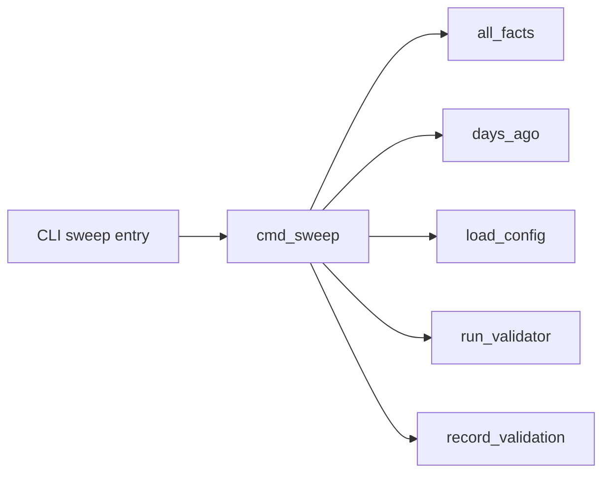

# SPEC-0001: Temporal Knowledge Graph

## Overview

`knowledge` is an external, evidence-backed memory system for coding agents.
It records observations separately from reviewable assertions, scopes facts to
repositories and time, and projects typed relations into a disposable graph.
The implementation currently provides episode capture, assertion retrieval,
structural migration, graph projection, and deterministic path validators.
This specification defines the target behaviour for expanding that baseline
without turning unreviewed model output into trusted memory.

## Goals

- Preserve a durable, auditable history of source observations and validation.
- Make retrieval repository-aware and valid at a requested date or commit.
- Grow typed graph relations from evidence-backed candidates rather than prose
  inference presented as fact.
- Sweep facts with deterministic validators that can support or contradict an
  assertion while retaining the evidence.
- Keep all store and index state outside repositories described by assertions.

## Non-Goals

- Replacing long-form notes or source documentation.
- Treating an embedding match or language-model conclusion as confirmation.
- Writing a store, cache, or generated graph into a target source repository.
- Building a general-purpose graph database or a universal ontology.

## Requirements

### Requirement: R1 External durable storage

The system MUST resolve the knowledge store independently of a repository that
an assertion describes. Episode records, pending candidates, confirmed
assertions, validation events, and the SQLite graph projection MUST be stored
outside that described repository. A missing or inaccessible store MUST result
in an actionable command error and MUST NOT create local state in the target
repository.

#### Scenario: Ingesting an observation about a repository

- **GIVEN** an agent is working in a source repository
- **WHEN** it ingests an observation about that repository
- **THEN** the episode is written to the resolved external store
- **AND** no store or cache file is created beneath the source repository

### Requirement: R2 Evidence and trust layers

The system MUST preserve raw episodes as untrusted evidence, pending assertions
as reviewable candidates, and confirmed assertions as the only trusted memory.
It MUST retain provenance and evidence for every candidate and assertion. A
candidate or episode MUST NOT become a confirmed assertion without an explicit
review action.

#### Scenario: Candidate capture without review

- **GIVEN** an agent proposes an atomic assertion with evidence
- **WHEN** no reviewer has confirmed it
- **THEN** the assertion is visible as pending
- **AND** normal retrieval does not present it as established fact

### Requirement: R3 Repository and temporal retrieval

The system MUST associate assertions and episodes with an explicit repository
when one is known. Retrieval MUST prefer facts for the current repository and
global facts, exclude other repositories by default, and permit an explicit
cross-repository query. Retrieval MUST honour an `as-of` date and, when a
checkout is available, the asserted commit interval.

#### Scenario: Recalling facts for a different repository

- **GIVEN** the store contains valid assertions for two repositories
- **WHEN** an agent recalls facts while working in the first repository
- **THEN** assertions for the second repository are excluded by default
- **AND** a query that explicitly requests all repositories may return them

### Requirement: R4 Evidence-backed typed relations

The system MUST support typed subject, predicate, and object fields for
assertions and project them into graph entities and edges. Future relation
extraction MUST emit reviewable candidates with source evidence; it MUST NOT
write inferred relations directly to the confirmed graph. The graph projection
MUST be rebuildable from durable records and safe to delete between runs.

#### Scenario: Extracting a repository ownership relation

- **GIVEN** a source document explicitly maps a repository to an owner
- **WHEN** relation extraction processes that document
- **THEN** it creates a pending typed candidate linked to the source episode
- **AND** the relation appears in trusted graph queries only after confirmation

### Requirement: R5 Deterministic validation and sweep history

The system MUST execute only declared deterministic validators during a sweep.
Each validation event MUST record the validator, target, timestamp, outcome,
and evidence. A validator MUST report `unknown` when it lacks sufficient
evidence and MUST NOT report `contradicted` solely because evidence is absent.
Contradiction MUST alter the assertion's current validity without deleting its
audit history.

#### Scenario: A referenced path no longer exists

- **GIVEN** a confirmed assertion is validated by a repository path check
- **WHEN** the checked path is absent in the applicable checkout
- **THEN** the sweep records a contradicted validation with the checked target
- **AND** the assertion remains available for audit as invalid

### Requirement: R6 Migration and compatibility

The system MUST migrate legacy confirmed assertions and pending candidates into
episode records idempotently. Migration MUST preserve the original assertion
body, source, provenance, and evidence where present. Re-running migration
MUST not duplicate equivalent episodes or alter already preserved source text.

#### Scenario: Re-running a completed migration

- **GIVEN** a legacy assertion already has its migration episode
- **WHEN** migration runs again
- **THEN** no duplicate episode is created
- **AND** the previously migrated assertion content is unchanged

### Requirement: R7 Error Handling Standards

All error-producing operations MUST add context at each command, store, graph,
or validator boundary. Domain failures that callers must distinguish MUST use
stable sentinel errors or equivalent typed errors. Commands MUST NOT silently
swallow failures: they MUST return an actionable error, log structured context,
or have a documented suppression. Failed graph projection or validation MUST
NOT silently change the trust state of an assertion.

#### Scenario: A validator cannot access its checkout

- **GIVEN** a sweep selects an assertion requiring a repository checkout
- **WHEN** the checkout cannot be resolved
- **THEN** the sweep records an `unknown` outcome with the failure evidence
- **AND** the assertion remains neither newly supported nor contradicted

### Requirement: R8 Database Operation Standards

The SQLite projection MUST use parameterized queries for assertion-derived
values. Multi-step durable mutations that require atomicity MUST use a
transaction or an equivalent recoverable write protocol. The projection MUST
manage connection lifecycle and surface lock, corruption, and migration errors
with store context.

#### Scenario: Rebuilding a graph from assertion text

- **GIVEN** an assertion includes characters meaningful to SQL syntax
- **WHEN** the graph projection rebuilds its entities and edges
- **THEN** the assertion-derived values are bound as query parameters
- **AND** the rebuild cannot execute assertion text as SQL

## Implementation

> Call graphs generated from current codebase. Re-run `/sdd:spec --update
> SPEC-0001` after implementation to refresh.

### Requirement-to-Function Mapping

**REQ "Deterministic validation and sweep history"**: functions
`cmd_sweep()` → `run_validator()` → `record_validation()`

### Call Graph

<!-- Call graph: cmd_sweep, generated 2026-09-18; bounded to seven nodes. -->

The current implementation already has a small, explicit sweep seam. The
filtered one-hop call graph below is the implementation anchor for R5.

R1 and R2 map to external store resolution, episode writing, and pending
review commands. R3 maps to assertion retrieval and repository/commit context.
R4 maps to the rebuildable graph projection. R6 maps to the legacy migration
command. The next implementation slices are specified in the paired
[design](design.md).

## Acceptance Criteria

- Automated tests cover each required scenario and preserve source fidelity
  across a repeated migration.
- A repository-aware, date-aware retrieval test demonstrates default isolation
  and explicit cross-repository access.
- A sweep test demonstrates supported, contradicted, and unknown outcomes.
- The external-data guard verifies that the implementation does not write a
  store or graph cache into a described repository.
